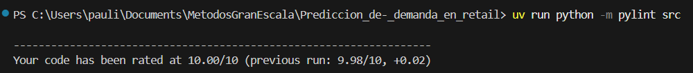

# Prediccion_de-_demanda_en_retail

Para una mejor experiencia del Executive Summary, visita nuestro [sitio](https://1c-company-itam.my.canva.site/m-s-software-cercano-al-cliente)

## Descripción del proyecto

Este repositorio implementa un pipeline end-to-end de Machine Learning para **pronosticar ventas futuras** (demanda mensual) a nivel **producto–tienda–mes**, basado en el dataset de la competencia *Predict Future Sales*. El flujo cubre exploración, preparación de features, entrenamiento, evaluación y generación de predicciones en batch.


## 🧠 Objetivo

Desarrollar un modelo de Machine Learning end-to-end que prediga ventas futuras en retail, aplicando el flujo completo de ciencia de datos desde la exploración hasta la comunicación de resultados a stakeholders de negocio.

---

## Contexto del Negocio

Este caso de estudio está basado en datos reales provistos por **1C Company**, una de las firmas de software más grandes de Rusia, que opera una cadena de tiendas retail distribuidas en múltiples ciudades.

La compañía enfrenta el desafío clásico del retail moderno: balancear inventarios para más de **22,000 productos** distintos a través de **60 ubicaciones** diferentes, mientras mantiene costos operativos bajo control y maximiza la satisfacción del cliente.

Con tres años de datos transaccionales históricos que capturan millones de ventas diarias, la empresa se encuentra en el punto de inflexión perfecto para implementar soluciones de machine learning que transformen sus operaciones de supply chain.

El Chief Operations Officer (COO) y el Chief Innovation Officer (CIO) han preparado las siguientes comunicaciones para explicar la urgencia y visión estratégica detrás de este proyecto de Data Science:

### Del Chief Operations Officer (COO)

> Enfrentamos un problema crítico de inventario que está destruyendo valor. El **23%** de nuestro inventario está en sobrestock, generando altos costos de almacenamiento y obligándonos a liquidar con descuentos del 35%. Al mismo tiempo, tenemos quiebres de stock en productos clave el **18%** del tiempo, perdiendo **$6.8M USD** en ventas y provocando que nuestro Net Promoter Score cayera 12 puntos.
>
> Nuestros planificadores usan métodos tradicionales—promedios móviles y ajustes manuales—que no pueden manejar la complejidad de 60 tiendas y 22,170 productos con patrones que varían por ubicación y estacionalidad. Ajustamos inventarios cada 14 días mientras la competencia lo hace en 48 horas.
>
> **Necesitamos reducir nuestro error de predicción de RMSE ~11 unidades a menos de 5 unidades** para alcanzar nuestro margen operativo objetivo del 8.5% y mejorar nuestro inventory turnover de 6.2x a 9x anual.

### Del Chief Innovation Officer (CIO)

> Tenemos una oportunidad transformacional. Tres años de datos transaccionales históricos (2.9M registros) nos permiten implementar machine learning para predecir demanda con precisión granular a nivel producto-tienda-mes, anticipando comportamientos futuros en lugar de solo reaccionar al pasado.
>
> Mi visión es empoderar a nuestros demand analysts con herramientas de Data Science e IA que automaticen el 70% de predicciones rutinarias, liberándolos para estrategias de alto valor. Los modelos modernos pueden capturar patrones complejos que los métodos tradicionales ignoran: efectos de promociones, estacionalidad regional, y eventos externos.
>
> Con ML en producción, actualizaremos predicciones diariamente con intervalos de confianza para gestión de riesgo informada. Este proyecto es el primer paso hacia una organización data-driven donde inventario, pricing, y staffing se respalden con modelos predictivos. **El ROI está en construir capacidades que nos mantengan competitivos la próxima década.**

---

## Datos 📚

**Fuente:** [Kaggle - Predict Future Sales Competition](https://kaggle.com/competitions/competitive-data-science-predict-future-sales)

> Alexander Guschin, Dmitry Ulyanov, inversion, Mikhail Trofimov, utility, and Μαριος Μιχαηλιδης KazAnova. *Predict Future Sales*. Kaggle, 2018.

### Datasets disponibles

| Archivo | Descripción |
|---------|-------------|
| `sales_train.csv` | Datos históricos de ventas diarias (2013-2015) |
| `test.csv` | Combinaciones producto-tienda para predicción |
| `items.csv` | Información de productos y categorías |
| `shops.csv` | Información de tiendas |
| `item_categories.csv` | Categorías de productos |

### Métrica de evaluación

**Root Mean Squared Error (RMSE)**

---

## Resultados

- **Tamaño de datos cargados:** `items` = 22,170 filas; `sales_train` = 2,935,849 filas; `test` = 214,200 filas.
- **Limpieza aplicada:** se removieron 7,357 registros inválidos (precio ≤ 0 o ventas negativas).
- **Matriz final de features:** 11,098,754 filas y 19 features (meses 0–33; `test_month` = 34).
- **Validación (mes 33):**
  - Baseline (`item_cnt_month_lag_1`): **RMSE = 6.2925**
  - HistGradientBoostingRegressor: **RMSE = 2.9408** (mejor)
  - Ridge: RMSE = 3.3832
  - PoissonRegressor: RMSE = 3.4567
- **Tiempos de ejecución (máquina local):**
  - `train.py`: 44.11 s
  - `inference.py`: 56.07 s
- **Salida de inferencia:** `data/predictions/predictions.csv` (214,200 filas).
- Los logs de ejecución se guardan en `artifacts/logs/`.

**Kaggle leaderboard:** https://kaggle.com/competitions/competitive-data-science-predict-future-sales/leaderboard

---

## Dependencias principales

- pandas
- numpy
- scikit-learn
- joblib
- jupyter (para notebooks)

---

## 🧩 Estructura del repositorio

```text
Prediccion_de-_demanda_en_retail/
├── .gitignore
├── .python-version
├── README.md
├── pyproject.toml
├── uv.lock
├── artifacts/
│   ├── Predicción_de_demanda de retail_con_ML.pdf
│   ├── img/
│   ├── logs/
│   └── models/
├── data/
│   ├── inference/
│   ├── predictions/
│   ├── prep/
│   └── raw/
├── notebooks/
│   ├── 01_EDA.ipynb
│   └── 02_Model_train.ipynb
└── src/
    ├── inference.py
    ├── prep.py
    ├── train.py
    └── utils/
        ├── __init__.py
        └── logging_config.py
```

---

## 🧪 Clonar y ejecutar con uv

### 1) Clonar el repositorio
```bash
git clone https://github.com/Andrea-Monserrat/Prediccion_de-_demanda_en_retail.git
cd Prediccion_de-_demanda_en_retail
```

### 2) Configurar el entorno con uv
```bash
uv sync
```

### 3) Ejecutar el pipeline (scripts)
```bash
uv run python src/prep.py
uv run python src/train.py
uv run python src/inference.py
```

### 4) Abrir notebooks
```bash
uv run jupyter lab
```

---

## 📌 Scripts del pipeline (inputs/outputs)

- `src/prep.py`  
  - **Input:** `data/raw/`  
  - **Output:** `data/prep/` (por ejemplo: `matrix.csv.gz`, `meta.json`, `feature_cols.json`)

- `src/train.py`  
  - **Input:** `data/prep/`  
  - **Output:** `artifacts/models/` (por ejemplo: `model.joblib`, `train_report.json`, `feature_cols.json`)

- `src/inference.py`  
  - **Input:** `data/inference/` + `artifacts/models/model.joblib`  
  - **Output:** `data/predictions/predictions.csv`

---

## ✅ Calidad de Código

Evidencia de linting con **pylint** ejecutado sobre el directorio `src/`, con score final **10.0/10**.



---
📤 **Contacto:**
* Paulina Garza - paugarza2208@gmail.com
* Andrea Monserrat Arredondo Rodriguez - andrea.monserrat.ar@gmail.com
